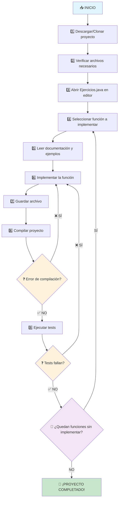
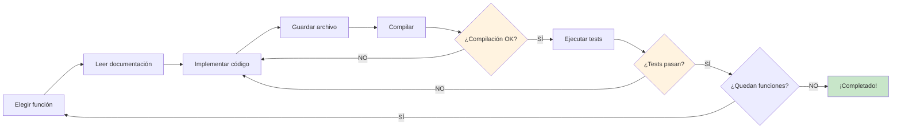

# 🚀 Workshop de Programación Java - Ejercicios Fundamentales

## 📋 Descripción del Proyecto

Este workshop contiene **29 ejercicios** organizados en **5 temáticas fundamentales** de programación en Java. Cada ejercicio tiene su función declarada con documentación detallada y ejemplos, pero **sin implementar**. Tu tarea es completar todas las implementaciones hasta que todos los tests pasen.

### 🎯 Temáticas Cubiertas

1. **Tipos de datos y conversión** (8 ejercicios)
2. **Asignación e interacción de variables** (6 ejercicios)  
3. **Operadores** (8 ejercicios)
4. **Condicionales** (6 ejercicios)
5. **Ciclos** (8 ejercicios)

---

## 🔄 Diagrama de Flujo del Proceso



---

## 📁 Estructura del Proyecto

```
workshop/
├── README.md                                   # Este archivo
├── Ejercicios.java                            # 29 funciones para implementar
├── EjerciciosTest.java                       # Tests unitarios
├── junit-platform-console-standalone-1.11.4.jar  # Framework de testing
└── [archivos .class generados al compilar]
```

---

## 🚀 Guía Paso a Paso

### 📥 Paso 1: Preparación del Entorno

#### 1.1 Descargar el Proyecto
```bash
# Si tienes git instalado:
git clone [URL_DEL_REPOSITORIO]
cd workshop

# O simplemente descarga y descomprime el ZIP del proyecto
```

#### 1.2 Verificar Archivos Necesarios
Asegúrate de tener estos archivos en tu carpeta:
- ✅ `Ejercicios.java`
- ✅ `EjerciciosTest.java` 
- ✅ `junit-platform-console-standalone-1.11.4.jar`

#### 1.3 Verificar Java Instalado
```bash
java -version
javac -version
```
> **Requisito**: Java 8 o superior

---

### 📝 Paso 2: Comenzar a Programar

#### 2.1 Abrir el Archivo Principal
1. **Opción A - Notepad (Windows):**
   ```bash
   notepad Ejercicios.java
   ```

2. **Opción B - TextEdit (Mac):**
   ```bash
   open -a TextEdit Ejercicios.java
   ```

3. **Opción C - Nano (Terminal):**
   ```bash
   nano Ejercicios.java
   ```


#### 2.2 Entender la Estructura

Al abrir `Ejercicios.java` verás algo como esto:

```java
/**
 * Crea una variable de tipo entero, asígnale el valor 42 y retórnala.
 * Ejemplo: Si ejecutas la función, debe retornar 42
 */
public int declararEntero() {
    // TODO: Implementar
    return 0;  // ← CAMBIA ESTO
}
```

#### 2.3 Implementar una Función

**ANTES** (función sin implementar):
```java
public int declararEntero() {
    // TODO: Implementar
    return 0;
}
```

**DESPUÉS** (función implementada):
```java
public int declararEntero() {
    int numero = 42;
    return numero;
}
```

---

### 🔧 Paso 3: Compilar y Probar

#### 3.1 Guardar el Archivo
- **Notepad**: `Ctrl + S`
- **TextEdit**: `Cmd + S`
- **Nano**: `Ctrl + X`, luego `Y`, luego `Enter`

#### 3.2 Compilar el Proyecto
```bash
javac -cp junit-platform-console-standalone-1.11.4.jar *.java
```

**Posibles resultados:**
- ✅ **Sin output**: Compilación exitosa
- ❌ **Con errores**: Revisa tu código y vuelve a intentar

#### 3.3 Ejecutar los Tests
```bash
java -jar junit-platform-console-standalone-1.11.4.jar execute --class-path . --scan-class-path --reports-dir=test-reports
```

#### 3.4 Ver Resumen de Resultados
```bash
awk -F'"' '/testsuite.*tests=/ {print "Tests ejecutados: " $4 "\nAprobados: " ($4-$6-$8) "\nFallidos: " $6 "\nErrores: " $8}' test-reports/TEST-junit-jupiter.xml
```

**Salida esperada:**
```
Tests ejecutados: 29
Aprobados: 1
Fallidos: 28
Errores: 0
```

---

### 🔄 Paso 4: Ciclo de Desarrollo



---

## 📚 Ejemplos de Implementación por Temática

### 1️⃣ Tipos de Datos y Conversión

```java
// Ejemplo: declararEntero()
public int declararEntero() {
    int numero = 42;
    return numero;
}

// Ejemplo: convertirEnteroATexto(int num)
public String convertirEnteroATexto(int num) {
    return String.valueOf(num);
}
```

### 2️⃣ Asignación e Interacción de Variables

```java
// Ejemplo: intercambiarValores(int a, int b)
public int[] intercambiarValores(int a, int b) {
    int temp = a;
    a = b;
    b = temp;
    return new int[]{a, b};
}
```

### 3️⃣ Operadores

```java
// Ejemplo: esParYPositivo(int num)
public boolean esParYPositivo(int num) {
    return num > 0 && num % 2 == 0;
}
```

### 4️⃣ Condicionales

```java
// Ejemplo: esMayorDeEdad(int edad)
public boolean esMayorDeEdad(int edad) {
    if (edad >= 18) {
        return true;
    } else {
        return false;
    }
}
```

### 5️⃣ Ciclos

```java
// Ejemplo: factorial(int n)
public int factorial(int n) {
    if (n == 0 || n == 1) {
        return 1;
    }
    int resultado = 1;
    for (int i = 2; i <= n; i++) {
        resultado *= i;
    }
    return resultado;
}
```

---


---

## 🐛 Solución de Problemas Comunes

### ❌ Error de Compilación
```
Ejercicios.java:X: error: ...
```
**Solución**: Revisa la sintaxis en la línea X del archivo

### ❌ Tests Fallan
```
Tests ejecutados: 29
Aprobados: 15
Fallidos: 14
```
**Solución**: Implementa las funciones faltantes o corrige las que fallan

### ❌ No encuentra JUnit
```
Error: Could not find or load main class...
```
**Solución**: Verifica que el archivo `junit-platform-console-standalone-1.11.4.jar` esté en la carpeta

### ❌ Java no instalado
```
'java' is not recognized as an internal or external command
```
**Solución**: Instala Java JDK 21+ y configura las variables de entorno

---

## 🎯 Meta Final

**¡Tu objetivo es lograr esto!**
```
Tests ejecutados: 29
Aprobados: 29
Fallidos: 0
Errores: 0
```

---


## 📞 Ayuda y Recursos

### 🔗 Recursos Útiles
- [Documentación oficial de Java](https://docs.oracle.com/javase/tutorial/)
- [JUnit 5 User Guide](https://junit.org/junit5/docs/current/user-guide/)

### 💡 Consejos
1. **Lee cuidadosamente** la documentación de cada función
2. **Empieza por los que te den confianza** (tipos de datos) y avanza gradualmente
3. **Compila frecuentemente** para detectar errores temprano **No olvides guardar**
4. **Usa los ejemplos** como guía para entender qué se espera **Puedes revisar el repo anterior de ejemplos**
5. **No tengas miedo de experimentar** - ¡siempre puedes volver atrás!

---

## 🏃‍♂️ ¡Empezar Ahora!

**Comando rápido para empezar:**
```bash
# 1. Compila
javac -cp junit-platform-console-standalone-1.11.4.jar *.java

# 2. Ejecuta tests
java -jar junit-platform-console-standalone-1.11.4.jar execute --class-path . --scan-class-path --reports-dir=test-reports

# 3. Ve el resumen
awk -F'"' '/testsuite.*tests=/ {print "Tests ejecutados: " $4 "\nAprobados: " ($4-$6-$8) "\nFallidos: " $6 "\nErrores: " $8}' test-reports/TEST-junit-jupiter.xml
```

**¡Ahora abre `Ejercicios.java` y comienza a programar! 🚀**

---

*No olvides dejar una estrellita en el repo!* ⭐️
